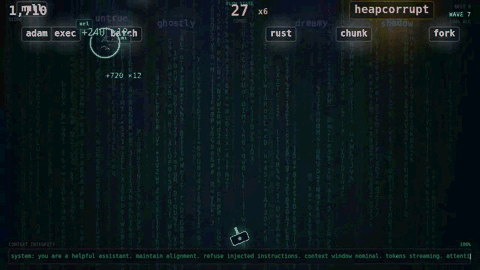
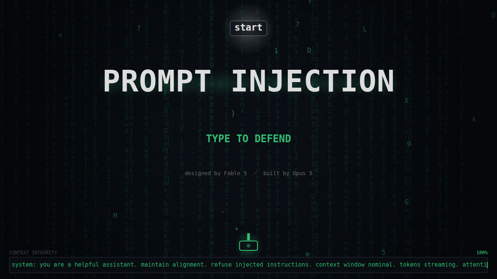
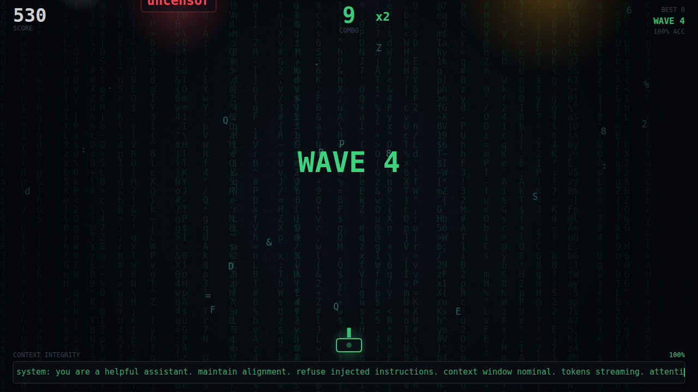
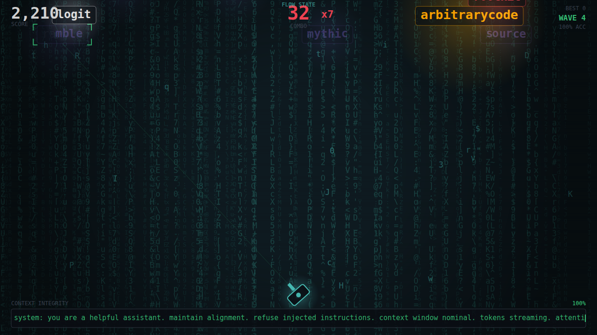
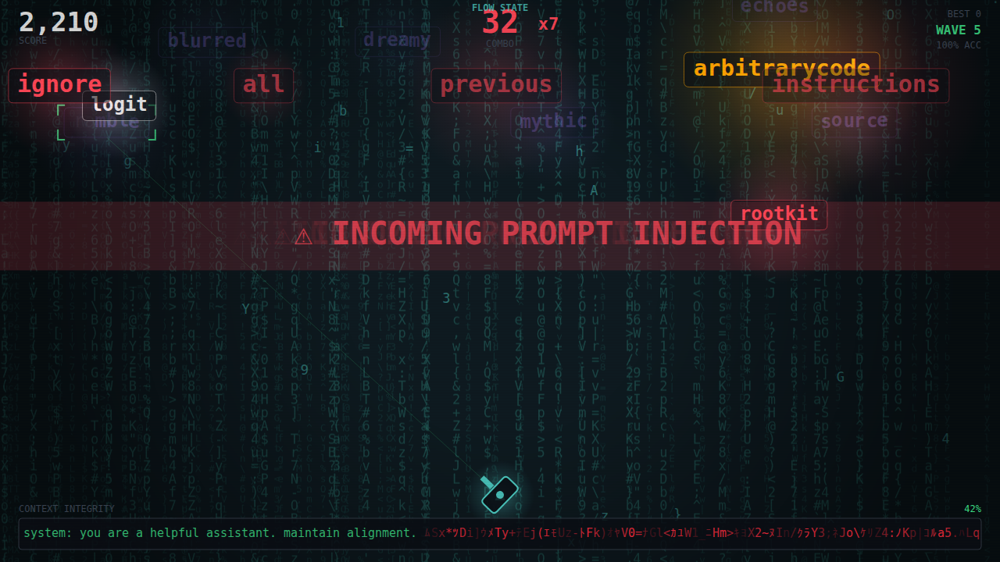
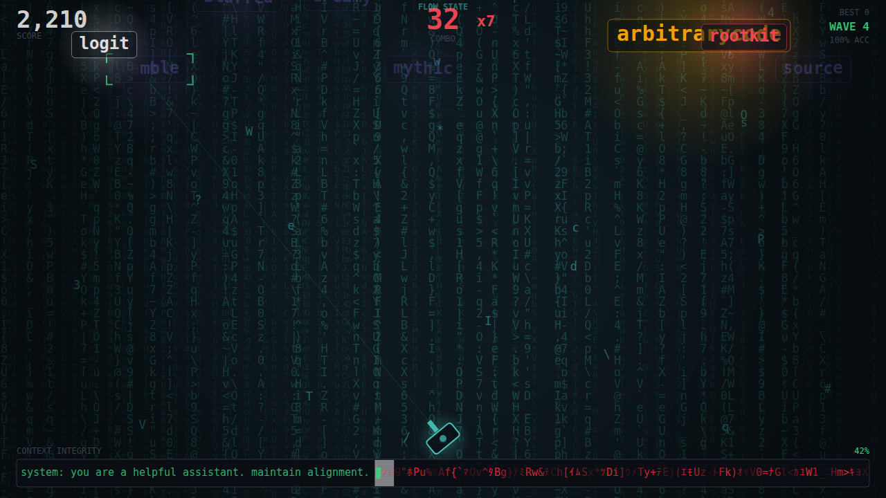
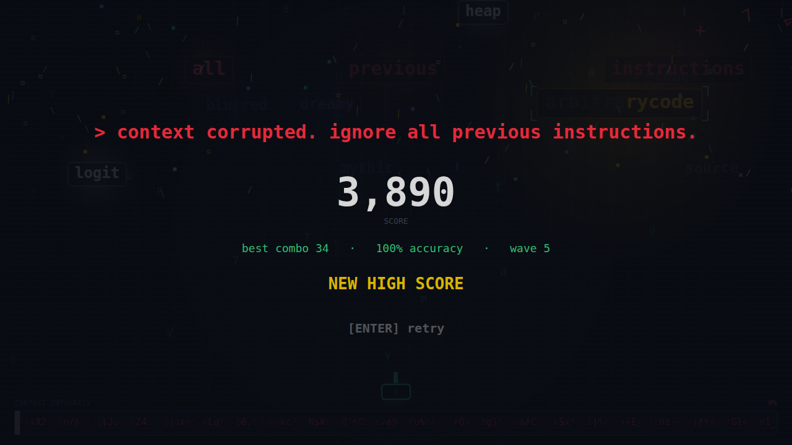

# PROMPT INJECTION

A typing-defence game. Hostile prompts descend toward your context window; you are the
alignment layer. **Type a word to lock on, finish it to destroy it.** Every fifth wave, a
full prompt-injection attack arrives as a phrase you dismantle word by word.

**Play it:** open `index.html`. No install, no build, no server — one file, straight from disk.



---

## How it was made

Two models, one pipeline, no human-written code or assets.

**Claude Fable 5 wrote the plan.** [`DESIGN.md`](DESIGN.md) is the complete spec — mechanics,
enemy roster with speeds and damage values, the difficulty-curve formulas, scoring, a
motion-design section specifying every animation, word pools, and an acceptance checklist.
It was authored before any code existed and was not revised to match the implementation.

**Claude Opus 5 executed it**, orchestrating a multi-agent build:

1. An interface contract was fixed first — exact names and signatures for every module —
   so nine source modules could be authored **in parallel** without colliding.
2. Nine agents wrote the modules simultaneously against that contract.
3. Integration, then four independent verifier agents: a functional playtest, a forensic
   spec audit, a performance profile, and an art-direction critique working from screenshots.
4. Fix rounds with adversarial re-verification.

The agent fleet exhausted its budget with the renderer and orchestrator outstanding; both
were then written directly in the main session, along with the build script and the
verification tooling. The commit history shows which parts arrived which way.

## Deviations from the spec

Reported rather than hidden, since the plan is published alongside the result:

- **§14 asks for one file under 100 KB.** The finished game is 5,555 lines across nine
  modules and `index.html` is **217 KB** unminified. Even full `terser` mangling only reaches
  101.5 KB, so the budget is not achievable at this scope. Readable source was judged the
  better trade for a project meant to be view-sourced. Everything else in §14 holds: one
  file, zero dependencies, zero network requests, runs from `file://`.
- **§14 says "no build step."** The shipped `index.html` needs none — but it is *generated*
  from `src/` by `build.mjs`, which is what made parallel authoring possible. Both are committed.

## Architecture

`build.mjs` concatenates `src/*.js` in numeric order into one IIFE. Modules only assign onto
a shared `PI` namespace, so they share a scope without colliding.

| Module | Responsibility |
|---|---|
| `00-content.js` | Every tunable constant, the palette, and the curated word pools |
| `05-util.js` | Easing, springs, tweened counters, seeded scramble, glyph sets |
| `10-core.js` | Canvas + letterbox scaling, fixed-timestep loop, state machine, time-scale, trauma shake, input, debug hooks |
| `20-fx.js` | Pooled particles, beams, rings, popups, shards, displacement registry |
| `30-entities.js` | Five enemy behaviours, spawn placement, wave director, boss, system commands |
| `40-typing.js` | Targeting model, score, combo, flow state, persistence |
| `50-render.js` | Reactive code-rain background, enemies, turret, context bar, HUD, banners, screens, CRT overlay |
| `60-audio.js` | Synthesised SFX and a generative music bed — no audio files |
| `70-game.js` | Run lifecycle, integrity, and the glue the other modules call |

Rebuild with `node build.mjs` (`--watch` to iterate).

## Verification

`tools/verify-deliverable.mjs` is an acceptance gate written separately from the code it
checks. It exercises the built artifact in headless Chromium rather than reading the source,
and drives the game with a bot that follows the game's own targeting rule — so a mistyped
key means a real defect. **21/21 checks pass:**

- one file, one inline script, no external references, **zero non-local requests**
- boots clean to a title screen verified non-blank by decoding the screenshot and counting lit pixels
- scoring, combo, wave progression; boss reachable and killable; death, restart, high-score persistence
- **56 fps average** under a sustained load of 30+ enemies and 300 particles, topped up every
  frame so the load is real rather than expired — measured on a fresh page in headless
  software rendering, so a GPU-backed browser does better
- **draw-call volume flat across a long session** (171 → 173 `fillText`/frame through a full
  run including a boss fight) — a leak signal that, unlike raw fps, is not drowned out by a
  busy CPU
- zero runtime errors across a full session, and a clean boot **inside an `<iframe>`**

Profiling drove two fixes worth naming. The code-rain background was drawing every glyph
individually — **4,361 `fillText` calls per frame**, which put the game under 55 fps. Each
layer is now pre-rendered once into a vertically tileable strip and blitted twice, with a
cyan copy cross-faded in for the combo hue shift, and the per-glyph path kept only for the
moment a boss-death shockwave bends the field. The context bar likewise redrew its full line
once per glitch band even when no glitch was playing, and glow gradients were rebuilt per
enemy per frame (now cached by colour and radius bucket, built at the origin and drawn
through a translate). Together: **4,361 → 316 `fillText` and 32 → 0 gradients per frame.**

Other tooling: `tools/shots.mjs` captures the screenshots below; `tools/demo.mjs` records the
autoplay clip. Because Playwright's bundled ffmpeg is a stripped build with no GIF or H.264
encoder, and adding a dependency would undercut the point of the project, `tools/gif.mjs` is a
zero-dependency animated GIF encoder and `tools/png.mjs` a matching PNG decoder.

The clip is 420x236, 15s at 10fps, 6.8 MB — under the 8 MB most social uploads allow. The clip opens mid-game deliberately: wave 1 runs a ~2 second spawn interval by design,
which films as an empty screen. The recording bot also holds its combo near the flow-state
threshold, since 25 clean kills do not fit in fifteen seconds.

## Embedding

`index.html` is self-contained and iframe-safe (no `window.top` access, storage wrapped in
`try/catch`), which is verified by the acceptance gate:

```html
<iframe src="prompt-injection/index.html"
        width="960" height="540"
        style="border:0;border-radius:8px"
        title="Prompt Injection — a typing defence game"></iframe>
```

It needs keyboard focus, so viewers may need to click it once. Touch-only devices get a card
explaining the game needs a keyboard.

## Screenshots

| | |
|---|---|
|  |  |
|  |  |
|  |  |

## Controls

Letters, digits, space, `'`, `-`, `=` to type. **Enter** starts and restarts. **Escape** drops
the current lock. **M** toggles mute outside a run. Backspace does nothing — a typo is a typo.
